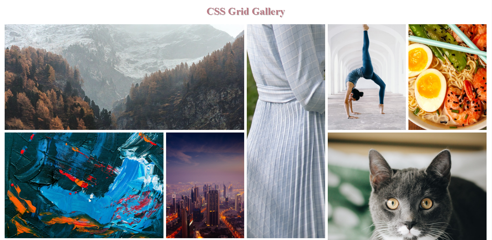

## Table of contents

- [Overview](#overview)
  - [The challenge](#the-challenge)
  - [Screenshot](#screenshot)
  - [Links](#links)
- [My process](#my-process)
  - [Built with](#built-with)
  - [What I learned](#what-i-learned)
  - [Continued development](#continued-development)
- [Author](#author)

## Overview

A responsive photo gallery created using CSS Grid

### The challenge

Creating a fun and simple responsive image gallery using CSS Grid.

### Screenshot

### Links

- Live Site URL: https://css-grid-responsive-gallery.pages.dev/
## My process

- I wanted to create a responsive image gallery with CSS Grid.
- The gallery was populated with images from Unsplash.com.
- The gallery has different kinds of images.
- If you refresh the page the gallery will upload new images for each image category.
- By hovering over an image you will see which category it belongs to while it also animates!

### Built with

- Semantic HTML5 markup
- CSS Grid
- CSS animation

### What I learned

I found this to be a good use case for CSS Grid. 

### Continued development

I will continue to improve my layout skills and get more comfortable with CSS Grid.

## Author

- Website - https://www.annie-indreiten.com/
- Github – https://github.com/AnnieCat73
- LinkedIn - https://www.linkedin.com/in/annie-indreiten777/

